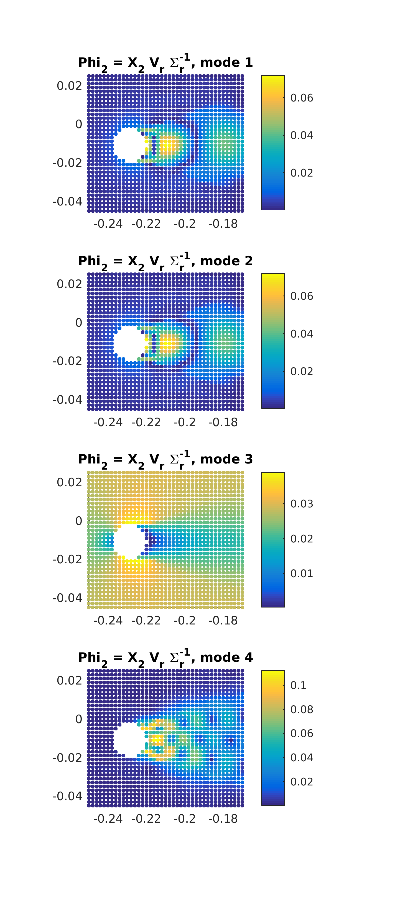
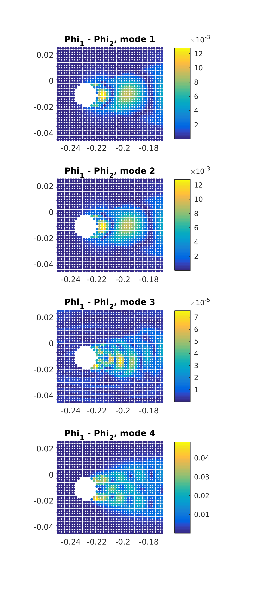

# DMD codes

## DMD modes analysis

In this exercise we compute the difference between DMD modes calculated from two approaches:

Phi_1 = Ur * W
Phi_2 = X2 * Vr * inv(Sigmar) * W

### Difference between modes

### The residual of the difference between two modes

